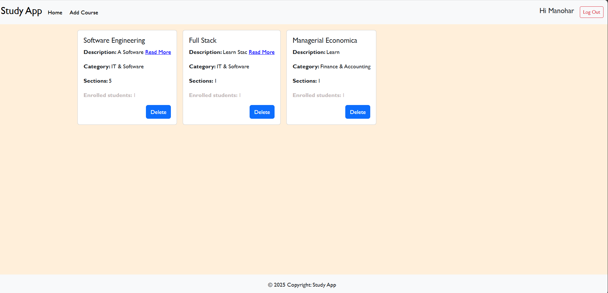
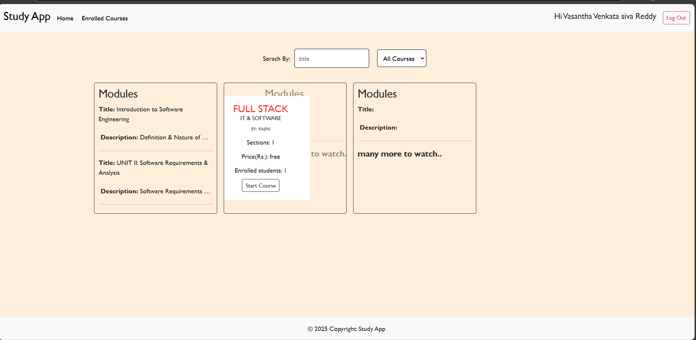
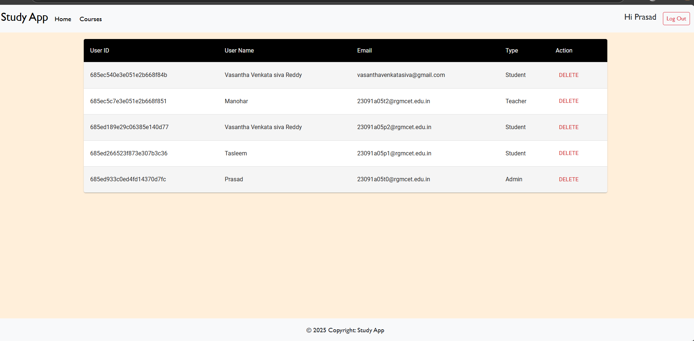

[▶️ Watch Demo Video](DemoVideo_.mp4)

---
## Sample Documentation
## 📘 LearnHub – Your Center for Skill Enhancement

## 👥 Team Members
- **Venkata Siva Reddy** – Full Stack Developer  
- **Chenna Rajyalakshmi** – Full Stack Developer  
- **Thupakula Venkata Kumar** – Front End Developer

---

## 📌 1. Project Overview

### 🎯 Purpose
To provide a user-friendly and feature-rich **Online Learning Platform** that connects students and teachers for interactive, self-paced learning experiences. The platform supports course management, student progress tracking, certification, and admin oversight.

### 🚀 Features
- 🔑 Role-based users: Student, Teacher, Admin
- 📚 Course creation, enrollment, and certification
- 🔍 Search & filter functionality
- 💳 Premium course access with payment
- 📱 Fully responsive design using React + Material UI
- 🧠 Scalable MongoDB storage
- 🔐 Secure authentication & authorization with JWT

---

## 🏗️ 2. Architecture

### 🖥️ Frontend
- Built with **React.js** + **Vite**
- Axios for REST API communication
- UI: **Material UI** + **Bootstrap**
- Component-based modular structure

### 🛠️ Backend
- Node.js + Express.js RESTful API
- Authentication with **JWT**
- Mongoose ODM for MongoDB schema modeling

### 🗃️ Database
- **MongoDB**
- Collections: `Users`, `Courses`, `Enrollments`
- `userID` used as foreign key in `Courses` to link creators

---

## ⚙️ 3. Setup Instructions

### ✅ Prerequisites
- [Node.js & npm](https://nodejs.org/en/download/)
- [MongoDB Community Edition](https://www.mongodb.com/try/download/community)
- Git, Terminal, Browser

### 📥 Installation
```bash
git clone <repo-url>
cd containment-zone

cd frontend
npm install

cd ../backend
npm install
````

---

## 📁 4. Folder Structure

```
frontend/
├── public/
├── src/
│   ├── components/
│   ├── pages/
│   ├── utils/
│   ├── App.jsx
│   └── main.jsx

backend/
├── controllers/
├── routes/
├── models/
├── middleware/
├── config/
├── app.js
├── server.js
```

---

## ▶️ 5. Running the Application

### 🔧 Backend

```bash
cd backend
npm start
```

### 🌐 Frontend

```bash
cd frontend
npm run dev
```

Visit the app at: [http://localhost:5172](http://localhost:5172)

---

## 📡 6. API Documentation

### 👨‍🏫 Teacher

* `POST /api/courses/create` – Create a course
* `PATCH /api/courses/:id/sections` – Edit course sections
* `DELETE /api/courses/:id` – Delete course

### 🎓 Student

* `POST /api/courses/enroll` – Enroll in a course
* `GET /api/courses/search` – Search for courses
* `GET /api/certificates/:courseId` – Get certificate

### 🛡️ Admin

* `GET /api/admin/users` – List all users
* `DELETE /api/admin/course/:id` – Remove course
* `GET /api/admin/enrollments` – View enrollments

---

## 🔐 7. Authentication

* Uses **JWT tokens**
* Tokens stored in **HTTP-only cookies** or **localStorage**
* **Role-based access** via backend middleware

---

## 🖼️ 8. User Interface Overview

### 🏠 Home Page
Displays featured/popular courses  


### 👨‍🏫 Teacher Dashboard
Create and manage courses  


### 🎓 Student Dashboard
Track enrolled courses and progress  


### 🛡️ Admin Panel
Manage users, courses, and enrollments  


---

## 🧪 9. Testing

* Manual API testing via **Postman**
* UI form validation and error handling
* Covers edge cases like:

  * Invalid login
  * Unauthorized access
  * Invalid course/user IDs

---

## 📸 10. Screenshots & Demo

| Feature        | Screenshot              |
| -------------- | ----------------------- |
| Course Listing | *(./Images/Enroll.png)* |
| Teacher Panel  | *(./Images/Teacher.png)* |
| Student Panel  | *(./Images/Student.png)* |

🔗 [▶️ Watch Demo Video](./DemoVideo_.mp4) – *(hosted in the same folder)*

---

## 🐞 11. Known Issues

* 🧪 Mock payment gateway integration
* 📧 No email verification implemented
* 🎨 UI enhancements are pending

---

## 🔮 12. Future Enhancements

* 📹 Add **video tracking** per lesson
* 🧑‍🏫 Integrate **live classes** via WebRTC/Zoom API
* ⭐ Add **reviews/ratings** for courses
* 📩 Enable **email notifications**
* 📊 Build a **dashboard for analytics**


